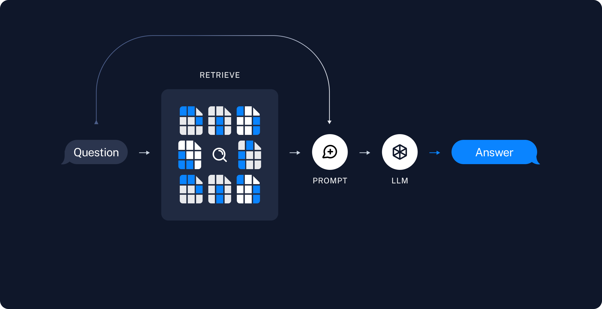

Here's a comprehensive `README.md` for the entire project:

---

# 🚀 Distributed Bitcoin Payment Wallet System

A decentralized Bitcoin wallet and payment system that leverages **Hyperbee**, **DHT (Distributed Hash Table)**, **RPC (Remote Procedure Calls)**, and **LangChain NLP** for seamless wallet management. This project enables users to create Bitcoin wallets, check balances, list transactions, and make payments using simple commands over a distributed network.

---

## 📜 Overview

This project consists of two primary components:

- **Server** (`payment-server`) – Manages wallet creation, transaction history, and payments through an RPC-based distributed system.
- **Client** (`payment-client`) – Interacts with the server by sending commands (like creating wallets or making payments) over RPC.

The system is powered by:

- **LangChain + Cohere** for NLP command embeddings
- **Hyperbee/Hypercore** for distributed storage
- **Bitcoin Electrum** for blockchain interaction
- **Hyperswarm RPC/DHT** for decentralized communication

---

## 📦 Project Structure

```
bitcoin-payment-wallet/
│
├── payment-server/                      # Backend server (RPC and wallet logic)
│   ├── index.js                         # Main server logic
│   ├── btc-wallet.js                    # Bitcoin wallet operations
│   ├── cohere.js                        # NLP Embedding (Cohere integration)
│   ├── lama-ai.js                       # AI utilities (optional)
│   ├── package.json                     # Server dependencies
│   └── .env                             # Environment variables for API keys
│
├── payment-client/                      # Client that interacts with the server
│   ├── client.js                        # Simple RPC client to test interactions
│   ├── index.js                         # Main client logic
│   └── package.json                     # Client dependencies
│
├── README.md                            # Project documentation
└── wallet-store/                        # Persistent wallet storage
```

## [Watch the video](https://www.loom.com/share/694d1e158ff04f6abb8df62cf5045e52?sid=deeaedbd-63b3-4afc-8300-7e91ace75856)

## ⚙️ Features

- **Create Bitcoin Wallets**
- **Retrieve Wallet Balances**
- **List Recent Transactions**
- **Send Bitcoin Payments**
- **Distributed, Decentralized Architecture**
- **NLP Command Recognition**

---

## 🛠️ Tech Stack

- **Node.js**
- **LangChain (NLP)**
- **Cohere (Embedding API)**
- **Hypercore / Hyperbee**
- **Hyperswarm (RPC + DHT)**
- **Electrum (Bitcoin API)**
- **lib-wallet** (Bitcoin wallet library)
- **BIP39** (Mnemonic seed generation)

---

## 🚀 Installation

### 1. Clone the Repository

```bash
git clone https://github.com/yourusername/bitcoin-payment-wallet
cd bitcoin-payment-wallet
```

---

### 2. Install Dependencies

#### Server

```bash
cd payment-server
npm install
```

#### Client

```bash
cd ../payment-client
npm install
```

---

### 3. Configure Environment Variables

Create a `.env` file in the **`payment-server`** directory with the following:

```plaintext
COHERE_API_KEY=your-cohere-api-key
ELECTRUM_HOST=electrum-host
ELECTRUM_PORT=electrum-port
DHT_HOST=dht-bootstrap-host
DHT_PORT=dht-bootstrap-port
```

---

### 4. Run the Server

```bash
cd payment-server
node index.js
```

---

### 5. Run the Client

```bash
cd ../payment-client
node client.js
```

---

## 🔧 How It Works

1. **LangChain** processes wallet-related commands using embedded documents.
2. A **Bitcoin Wallet** is created and connected to Electrum for blockchain access.
3. **Hyperbee** stores wallet seeds and DHT keys securely.
4. **RPC Server** listens for wallet-related requests and processes commands such as:

- Create Wallet
- Get Balance
- List Transactions
- Make Payments

5. The **client** sends requests (like `create-wallet`) over RPC, and the server executes the required wallet operations.

---

## 🧩 Example Commands

**Create a Wallet**

```json
{
  "message": "create a new bitcoin wallet"
}
```

**Check Balance**

```json
{
  "message": "show the balance"
}
```

**List Transactions**

```json
{
  "message": "list recent transactions of the wallet"
}
```

**Send Payment**

```json
{
  "message": "make a bitcoin payment from user wallet"
}
```

## RAG BASE Architecture

Overview
A typical RAG application has two main components:

Indexing: a pipeline for ingesting data from a source and indexing it. This usually happens offline.

Retrieval and generation: the actual RAG chain, which takes the user query at run time and retrieves the relevant data from the index, then passes that to the model.

Note: the indexing portion of this tutorial will largely follow the semantic search tutorial.

The most common full sequence from raw data to answer looks like:

Indexing
Load: First we need to load our data. This is done with Document Loaders.
Split: Text splitters break large Documents into smaller chunks. This is useful both for indexing data and passing it into a model, as large chunks are harder to search over and won’t fit in a model’s finite context window.
Store: We need somewhere to store and index our splits, so that they can be searched over later. This is often done using a VectorStore and Embeddings model.

## 

Retrieval and generation
Retrieve: Given a user input, relevant splits are retrieved from storage using a Retriever.
Generate: A ChatModel / LLM produces an answer using a prompt that includes both the question with the retrieved data


Once we’ve indexed our data, we will use LangGraph as our orchestration framework to implement the retrieval and generation steps.

## 📂 Testing

The project contains basic tests in the `test` directories of both client and server. To run them:

```bash
cd payment-server
npm test
```

```bash
cd ../payment-client
npm test
```

---

## 🛡️ Security

- **Mnemonic Seeds** – Wallets are generated using BIP39 for enhanced cryptographic security.
- **Distributed Storage** – Wallet data is stored using Hyperbee, ensuring decentralized persistence.
- **DHT Communication** – Wallet commands are processed over a distributed hash table, reducing reliance on centralized systems.

---

## 🧩 Troubleshooting

- Ensure Electrum host and port are correct in `.env`.
- Validate your **Cohere API Key** for NLP embeddings.
- Ensure the DHT bootstrap node is reachable.

---

## 🤝 Contributing

Feel free to submit pull requests or open issues for improvements.

---

## 📜 License

MIT License – Open source and free to use.

---

Would you like me to provide detailed explanations for how each component (like `btc-wallet.js` or `cohere.js`) functions?
